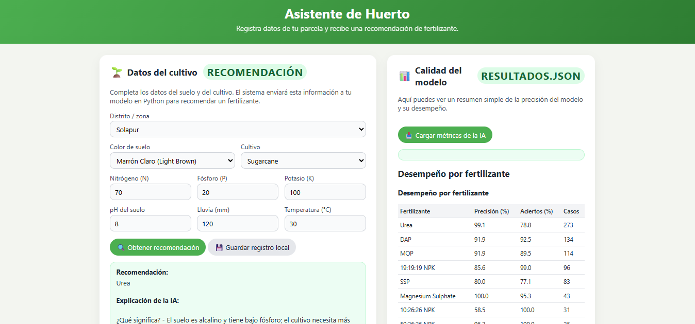
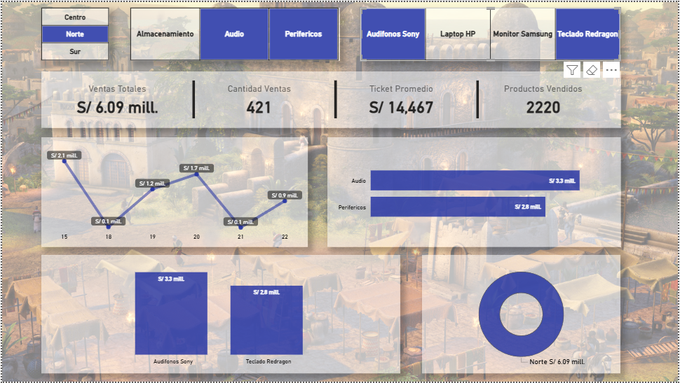

# 👋 Hola, soy Angel Marin

🎓 Estudiante de Ingeniería de Sistemas e Informática con interés en análisis de datos, automatización de procesos, desarrollo de aplicaciones y transformación digital.

Actualmente me encuentro fortaleciendo mi experiencia en proyectos académicos y personales relacionados con:

* 📊 Data Analytics y Business Intelligence
* 🐍 Python para automatización y análisis de datos
* 📈 Power BI y visualización de información
* ⚙️ Automatización de procesos con Power Automate
* 🌐 Desarrollo web y aplicaciones interactivas
* ☁️ Herramientas cloud e integración de servicios

---

## 💻 GitHub Stats

---

## 🚀 Sobre mí

Me interesa desarrollar soluciones que ayuden a optimizar procesos y facilitar la toma de decisiones basada en datos. Disfruto aprender nuevas tecnologías y aplicarlas en proyectos prácticos.

He trabajado en proyectos académicos orientados a:

* Análisis y visualización de datos
* Desarrollo de dashboards interactivos
* Automatización de tareas repetitivas
* Modelos predictivos aplicados a datos

Actualmente sigo construyendo proyectos para fortalecer mi perfil profesional orientado a prácticas preprofesionales en áreas de:

* Análisis de datos
* Business Intelligence
* Desarrollo de software
* Automatización de procesos
* Transformación digital

---

## 🛠️ Tecnologías y herramientas

### Lenguajes

* Python
* SQL
* Java

### Data & BI

* Microsoft Excel
* Power BI
* Pandas, NumPy, Matplotlib

### Automatización & Cloud

* Power Automate
* Python

### IA Generativa & LLMs

* ChatGPT
* Gemini
* Claude

---

## 📌 Proyectos destacados

### 🌱 Sistema Inteligente de Recomendación de Fertilizantes

Aplicación basada en Machine Learning e IA Generativa para recomendar fertilizantes según características agrícolas de una parcela.

Incluye:
* Modelo predictivo con Random Forest
* Procesamiento y transformación de datos agrícolas
* Interfaz web interactiva
* Explicaciones generadas mediante LLM
* Integración de Flask + Scikit-learn + Ollama API
* Persistencia de modelos y métricas

Tecnologías: Python, Flask, Scikit-learn, Pandas, Joblib, Ollama, HTML/CSS

---

### 📊 Pipeline Automatizado de Ventas y Business Intelligence

Pipeline automatizado end-to-end para generación, limpieza, almacenamiento, visualización y notificación de datos de ventas.

Incluye:
* Generación de datos simulados con errores intencionales
* Proceso ETL automatizado
* Limpieza y validación de datos
* Integración con Google Sheets y SQL Server
* Dashboard interactivo en Power BI
* Automatización completa mediante Power Automate
* Notificaciones automáticas por correo

Tecnologías: Python, Pandas, SQL Server, Google Sheets API, Power BI, DAX, Power Automate, SQLAlchemy

---

## 📚 Actualmente aprendiendo

* Machine Learning aplicado a análisis predictivo
* Arquitectura de datos y ETL
* Desarrollo Backend

---

## 📈 Objetivo profesional

Busco oportunidades de prácticas preprofesionales donde pueda seguir desarrollando habilidades técnicas, participar en proyectos reales y aportar soluciones basadas en datos y tecnología.

---

## 📫 Contacto

* 💼 LinkedIn: *(https://www.linkedin.com/in/angel-fabian-marin-yachachin-6b88712ba/)*
* 📧 Email: *(angelmariny01@gmail.com)*

---

## ⚡ Extra

Siempre estoy buscando aprender algo nuevo y convertir ideas en soluciones funcionales. 🚀
